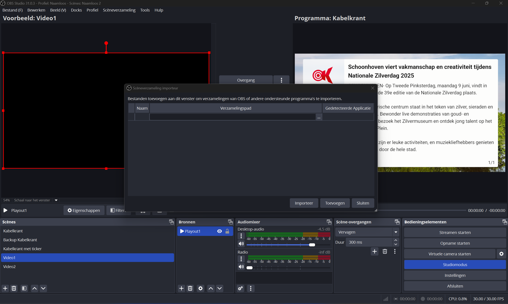

# How to set up the websocket

1. Go to tools (in the top bar) > websocket server settings

 2. Enable websocket server 2. Change the password to `rtvserver`

# How to set up the scenes

To properly configure the scenes in OBS for the Kabelkrant video playout system, you need to import the provided scene configuration:

## Step 1: Import Scene Collection

1. Open OBS Studio
2. Go to **Scene Collection** in the top menu bar
3. Select **Import**

4. Navigate to the settings folder in your project directory
5. Select the `Kabelkrant scenes.json` file
6. Click **Open** to import the scene collection

## Step 2: Activate the Imported Scene Collection

1. After importing, go to **Scene Collection** menu again
2. Select the newly imported "Kabelkrant" scene collection to make it active

## Required Scenes

The application expects the following scenes to be configured:

- **Kabelkrant** - Main scene for displaying content
- **Video1** - First video playout scene with source "Playout1"
- **Video2** - Second video playout scene with source "Playout2"

## Required Sources

Make sure the following sources are properly configured:

- **Radio** - Audio input source for radio/background audio
- **Playout1** - Media source for first video player
- **Playout2** - Media source for second video player

## Verification

After importing and activating the scene collection:

1. Check that all scenes are visible in the Scenes panel
2. Verify that each video scene contains the correct playout source
3. Ensure the Radio audio source is configured and working
4. Test that the websocket connection is working (green status in the application)

> **Note**: The scene configuration is critical for proper video playback. The application automatically switches between scenes and controls video sources based on the programmed schedule.
